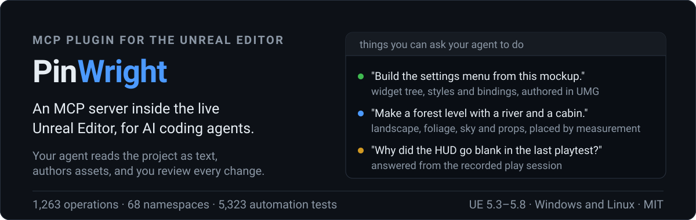

<p align="center"></p>

**Describe what you want in plain language and your AI coding assistant does it in the Unreal Editor:** builds Blueprints, edits the ones you already have, lays out UMG screens, creates assets, generates levels, runs tests. PinWright is an editor plugin that runs a local MCP server and connects the assistant you already use (Claude Code, Codex, Cursor, Gemini CLI, VS Code Copilot, or any other MCP client) to the editor itself. If you use one of these, you have everything you need: PinWright needs no subscription, API key or credits of its own and works through the AI plan you already pay for.

## What you can ask for

Talk to your agent about the game, and it works in the editor you have open:

- "Build the settings menu from this mockup." It authors the widget tree, styles and bindings in UMG, and you see the result in the designer.
- "Make a forest level with a river and a cabin." Landscape, foliage, sky and props, placed by measurement rather than guessed coordinates. The video below is one such level.
- "Create a jump pad Blueprint that launches the character upward on overlap." Gameplay logic from a sentence, compiled and ready to place.
- "Find every Blueprint that still reads the old Health variable and fix them." It dumps the project to text, greps it, edits the graphs and compiles them.
- "The door in the lobby does not open when the player walks up to it. Find out why and fix it." The agent starts Play-In-Editor, sends input to reproduce the bug, reads live game state and logs, fixes the Blueprint or C++, rebuilds, and plays again to confirm the fix.
- "Why did the HUD go blank in the last playtest?" It queries the recorded Play-In-Editor session (gameplay data needs instrumentation in your project).
- "Model a spur gear and a chess rook for the workshop scene." Both become Static Mesh assets from short text recipes; the same recipes ship as examples.
- "Set up sunset lighting: directional light, sky atmosphere, height fog, warm color grading." Placed and tuned in the open level.

## Example: a level from one prompt

Landscape, foliage, sky and placed props, generated by an agent through PinWright's level-generation namespaces from a single prompt. The video is the unedited result.

<p align="center"><a href="https://www.youtube.com/watch?v=XI2VqS1dJJ4"></a></p>

## What it is

An editor-only Unreal Engine plugin that speaks MCP (Model Context Protocol) on a loopback port. The assistant reads your project first, makes the change, compiles, and shows you the result. It also keeps everything it could already do on its own, including writing your C++ and rebuilding it through Unreal Build Tool; PinWright adds the editor side on top. We use it daily on a commercial UE5 title. It is strongest at inspecting and dumping a project, authoring Blueprints and UMG widgets, creating data assets, and recording Play-In-Editor sessions. Generating meshes, skeletons and animation from text recipes, building levels (terrain, foliage, sky, precise placement), and material and Niagara authoring are included but still experimental. 1,263 operations across 68 namespaces, developed against 5,323 automated tests.

## Quick start

1. **Get the plugin.** Install [from Fab](https://www.fab.com/listings/d9caf916-e5cf-435e-ab0e-a74cb8dcb253) through the Epic Launcher (a paid convenience install), or clone this repository, which is the same code under MIT:

   ```
   git clone https://github.com/PinWright/pinwright-ue.git <Project>/Plugins/PinWright
   ```

   If you cloned it elsewhere, move the `PinWright` folder into your project's `Plugins` directory or the engine's.

2. **Build and open.** Regenerate project files if your project is a C++ source checkout, build the editor target if Unreal asks for a rebuild, then open the editor and confirm the plugin under **Editor Preferences -> Plugins -> PinWright**.

3. **Click Install for your agent.** The **PinWright Setup** screen opens on startup (**Tools -> PinWright Setup** reopens it). One click writes that agent's project-local MCP config with the endpoint and token already filled in, so there is no file to edit and no port to look up.

   <p align="center"></p>

4. **Ask for something small.** For example: *"Dump /Game/UI to text, then tell me which widget bindings point at variables that no longer exist."*

## Features

| Area | What it does | Maturity |
| --- | --- | --- |
| Project inspection and dumps | Inspect assets, query dependencies, import, rename and organize; dump any asset or folder to readable text for review and accurate agent context | Core |
| Graph text IRs | Round-trip for Blueprint (BPIR), material (MGIR), animation Blueprint (AGIR), Control Rig (CRIR); decompile-to-text for behavior tree, sound cue, MetaSound, Niagara, PCG | Mixed |
| Blueprints and data assets | Create and edit classes, variables, functions, events and graphs; compile and decompile; author Data Tables and other data assets | Core |
| Widgets (UMG) | Author the widget tree, styles, bindings and animations; export and import as XML | Core |
| Actors, levels and system operations | Spawn actors, edit transforms, manage levels, inspect world state, read logs, run editor commands and build or test helpers | Core |
| Playtesting and bug fixing | Start Play-In-Editor, send input, read live game state and logs; an agent can reproduce a bug, fix it, rebuild, and play again to verify the fix | Core |
| Session recorder | Record a Play-In-Editor session and query it to debug what happened (needs small documented C++ hooks in your game for gameplay values) | Core |
| Model generation | `.pwmodel` text recipes of geometry operations compile into Static Mesh assets, with materials, collision and UVs; live modeling helpers on placed meshes (`geometry`, `model`) | Experimental |
| Skeleton and animation generation | `.pwskel` defines skeletons, skin weights, sockets and physics assets; `.pwanim` compiles animation clips; helpers for montages, blend spaces, IK and retargeting (`skeleton`, `animation`, `anim`) | Experimental |
| Level generation | Landscape terrain (grid spawn, sculpting, noise seeding), foliage, sky, fog and time of day, plus spatial reasoning: raycasts, surface placement and annotated captures so the agent places things by measurement (`landscape`, `environment`, `foliage`, `spatial`) | Experimental |
| Materials and Niagara | Material graph authoring through MGIR; Niagara system and emitter editing | Experimental |

## Requirements

Unreal Engine 5.3-5.8 editor build with C++ plugin support, on Windows or Linux. Per-version notes and known engine-specific caveats are in [docs/engine-version-support.md](docs/engine-version-support.md). The modules are editor-only and add nothing to your packaged game. PinWright enables the standard Epic engine plugins it integrates with (Niagara, ControlRig, GeometryScripting, PCG, Enhanced Input, GameplayAbilities and others; the full list is in `PinWright.uplugin`).

## How it works

<p align="center"></p>

Your client posts an MCP request to the editor, PinWright runs it on the game thread, and the result comes back as text, or as a job ticket for long work. Nothing leaves your machine.

Under the hood, graphs are text. This is BPIR, the Blueprint IR, and the capture underneath is the graph `blueprint.compile_bpir` built from exactly these four lines. Decompiling returns the text, so you can compare two versions of a graph line by line.

```text
entry custom_event AddPoints(int Points) {
    %new = call Add_IntInt(A: $Score, B: $Points)
    set Score = %new
    call_dispatcher OnScoreChanged(NewScore: %new)
}
```

<p align="center"></p>

Whole assets and whole folders convert the same way, which makes a project greppable:

```text
call("asset.dump_folder", { folderPath: "/Game/UI", recursive: true })
-> Saved/PinWright/asset-dumps/Game/UI/WBP_HUD/
     meta.json  properties.json  tree.xml  bpir.txt
```

## Why it is different

- Graphs have a text form. The agent builds new Blueprints, materials, animation Blueprints and Control Rigs from text, changes existing ones through editor commands, and decompiles any of them to text to check the result. Behavior trees, sound cues, MetaSounds, Niagara and PCG decompile to text for reading.
- Whole assets and folders dump to text. `asset.dump` and `asset.dump_folder` mirror packages into per-asset sidecars (`meta.json`, `properties.json`, `bpir.txt`, `tree.xml`, `mgir.txt` and more), so the agent knows your structure, classes and naming before it changes anything. That context is why new assets come out matching your project's conventions.
- Play-In-Editor sessions are recorded and can be queried. The agent asks what happened in a session rather than reading a log tail. Capturing gameplay data needs instrumentation in the host project.
- There is nothing to teach it. PinWright documents itself: the assistant discovers every operation and looks up its usage over the same MCP connection (`call()` lists the namespaces, `call("<namespace.method>")` returns that operation's page). You never paste documentation or install skill packs, and the reference always matches the version you run.
- Meshes, skeletons and clips have a text form too. `.pwmodel`, `.pwskel` and `.pwanim` recipes compile into Static Meshes, skeletal rigs and animation clips, so generated content stays in source control as text the agent can edit again. Fourteen mesh recipes and a rigged arm ship under [Examples/](Examples/).
- Local and authenticated by default: the listener binds to `127.0.0.1` and requires a bearer token.

## Agent setup

The setup screen installs Claude Code, Codex CLI, Cursor, Gemini CLI and VS Code Copilot with one click. For any other client, copy the **Agent setup prompt** from that screen and paste it to your agent, or use the snippets below. The port is per-project by default (derived from the project path, in the range `19880`-`30119`) and the token lives at `Saved/PinWright/gateway-token`; [docs/wiki-src/mcp-transport.md](docs/wiki-src/mcp-transport.md) has the transport defaults, port derivation and the stdio proxy's lifecycle tools.

<details>
<summary><strong>Manual setup (fallback)</strong>: per-agent config files</summary>

Manual equivalents of the one-click buttons. Substitute your project's resolved port for `19880`; `<project>` is the UE project the plugin is installed into.

**Claude Code**, `<project>/.mcp.json`, or `claude mcp add --transport http --scope project pinwright http://127.0.0.1:19880/mcp`. Project-scoped servers get a one-time approval prompt.

```json
{ "mcpServers": { "pinwright": { "type": "http", "url": "http://127.0.0.1:19880/mcp" } } }
```

**Codex CLI**, `<project>/.codex/config.toml`, loaded only after you trust the project (the first `codex` run in the folder prompts). `codex mcp add pinwright --url http://127.0.0.1:19880/mcp` registers it user-globally instead.

```toml
[mcp_servers.pinwright]
url = "http://127.0.0.1:19880/mcp"
startup_timeout_sec = 5.0
tool_timeout_sec = 300.0
```

**Cursor**, Settings -> Tools & MCP -> Add, or `<project>/.cursor/mcp.json`. No `type` key, Cursor auto-detects the transport; recent versions add project-file servers disabled, so enable it in Settings.

```json
{ "mcpServers": { "pinwright": { "url": "http://127.0.0.1:19880/mcp" } } }
```

**Gemini CLI**, `<project>/.gemini/settings.json`. The key is `httpUrl`, not `url`, because `url` means SSE in Gemini. Project config loads only for trusted folders (`gemini trust`).

```json
{ "mcpServers": { "pinwright": { "httpUrl": "http://127.0.0.1:19880/mcp" } } }
```

**VS Code (GitHub Copilot)**, `<project>/.vscode/mcp.json`. The top-level key is `servers`, not `mcpServers`, and VS Code prompts once to trust and start the server. User-level alternative: `code --add-mcp "{\"name\":\"pinwright\",\"type\":\"http\",\"url\":\"http://127.0.0.1:19880/mcp\"}"`.

```json
{ "servers": { "pinwright": { "type": "http", "url": "http://127.0.0.1:19880/mcp" } } }
```

**Windsurf**, `~/.codeium/windsurf/mcp_config.json` (user-level only), `"mcpServers"` entry `{ "serverUrl": "http://127.0.0.1:19880/mcp" }`. **Cline**, `cline_mcp_settings.json` in VS Code globalStorage, entry `{ "type": "streamableHttp", "url": "http://127.0.0.1:19880/mcp" }`.

**Stdio-only clients** bridge through the bundled proxy: run `Plugins/PinWright/Content/Python/mcp_proxy.py` with any Python 3, passing `--token-file` and `--port-file` pointing at the `gateway-token` / `gateway-port` files in `Saved/PinWright` (and optionally `--uproject` to select the project explicitly). It forwards stdio to the HTTP endpoint, sends the bearer token, follows the live port, and adds the local lifecycle tools, which is what the generated configs do.

</details>

## Security

This is editor automation with asset-mutation privileges: a request can create, edit, save, delete and compile project assets. Treat it as a local developer tool.

- Everything runs on your machine. The plugin makes no network calls of its own and the listener binds to `127.0.0.1`. Do not expose the port to a LAN, VPN, container bridge or the internet, and do not put a reverse proxy in front of it.
- A bearer token is required by default: 64 hex characters, generated on editor start at `Saved/PinWright/gateway-token`. It stops browser drive-by requests and other OS users; it is not a defense against code already running as you.
- Direct-HTTP agent configs embed the literal token, so keep them machine-local and never commit them; the stdio-proxy config carries only the token file path.
- Use trusted clients only, keep the project in source control, and review generated changes before committing.

Threat model, rotation steps and vulnerability reporting: [SECURITY.md](SECURITY.md).

## Documentation

The agent's reference is built in: every editor launch generates the full method wiki into the project's `Saved/PinWright/wiki/`, one flat page per namespace and method, which is what `call("<path>")` serves. Relocate it with **Wiki Output Directory** under **Project Settings -> Plugins -> PinWright (Project)**. Compilable IR samples ship in [Examples/](Examples): `.mgir` materials such as `Examples/mgir/M_PwReview_Neutral.mgir`, plus `.pwmodel`, `.pwskel` and `.pwanim` sources. [docs/index.md](docs/index.md) indexes the documentation, [docs/wiki-src/README.md](docs/wiki-src/README.md) holds the hand-written wiki pages and their authoring rules, [CONTRIBUTING.md](CONTRIBUTING.md) covers build, test and documentation conventions, and [CHANGELOG.md](CHANGELOG.md) is the release history.

## Support

Bug reports, critical gaps in existing features and feature requests all go through GitHub issues on [PinWright/pinwright-ue](https://github.com/PinWright/pinwright-ue/issues). Use the [bug report](https://github.com/PinWright/pinwright-ue/issues/new?template=bug_report.yml) form for a defect or a critical gap in an existing feature, the [compatibility report](https://github.com/PinWright/pinwright-ue/issues/new?template=compatibility_report.yml) form when the plugin does not load or build at all on your engine, and a [plain issue](https://github.com/PinWright/pinwright-ue/issues/new) for a new feature idea.

## License and attribution

MIT, see [LICENSE](LICENSE). Contributions are accepted under MIT with no CLA. Third-party components and their required notices are listed in [THIRD_PARTY_NOTICES.md](THIRD_PARTY_NOTICES.md); portions are derived from ChiR24/Unreal_mcp (MIT, (c) 2025 Unreal Engine MCP Server Contributors).
