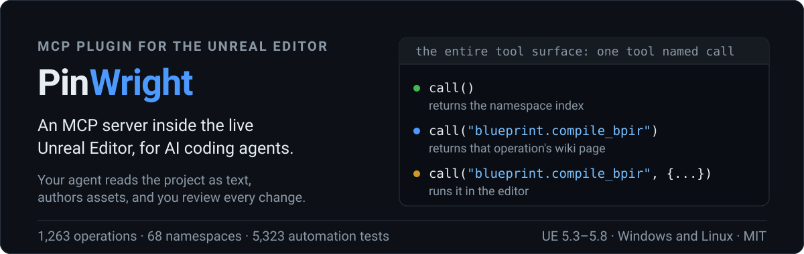
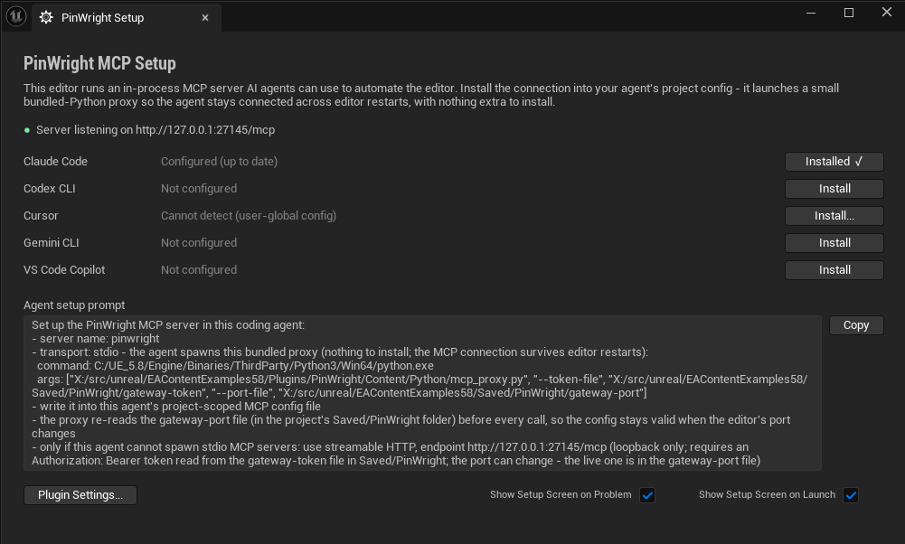
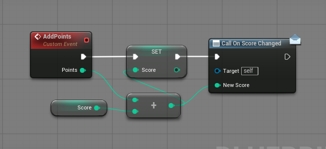
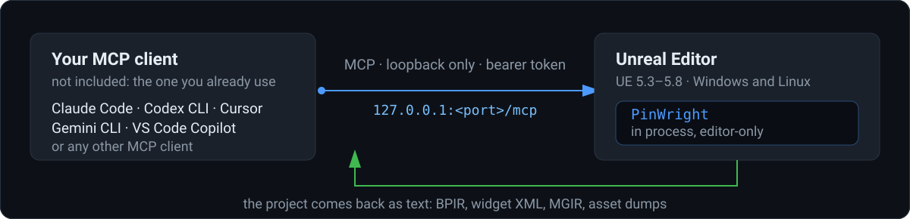

<p align="center"></p>

<p align="center"><a href="LICENSE"></a>  <a href="https://github.com/PinWright/pinwright-ue/releases"></a> <a href="https://pinwright.com"></a></p>

**Describe the change; the AI coding assistant you already use makes it in the live Unreal Editor while you watch.** PinWright runs a local MCP server inside the editor process, so that assistant can read your project as text and author assets in it.

## Proof

The plugin's entire UI is one screen: the resolved local endpoint, a listening server, and an **Install** button per agent that writes that agent's MCP config for you.

<p align="center"></p>

Graphs have a text form, so the agent writes text instead of clicking nodes. This is BPIR, the Blueprint IR, and the capture underneath is the graph `blueprint.compile_bpir` built from exactly these four lines. Decompiling returns the text, so that graph can be searched, reviewed and diffed in any git tool.

```text
entry custom_event AddPoints(int Points) {
    %new = call Add_IntInt(A: $Score, B: $Points)
    set Score = %new
    call_dispatcher OnScoreChanged(NewScore: %new)
}
```

<p align="center"></p>

Whole assets and whole folders convert the same way, which makes a project greppable:

```text
call("asset.dump_folder", { folderPath: "/Game/UI", recursive: true })
-> Saved/PinWright/asset-dumps/Game/UI/WBP_HUD/
     meta.json  properties.json  tree.xml  bpir.txt
```

## What it is

An editor-only Unreal Engine plugin that speaks MCP (Model Context Protocol) on a loopback port. Any MCP client can connect: Claude Code, Codex CLI, Cursor, Gemini CLI and VS Code Copilot get a one-click install, other clients get a config snippet. No account, no API key, no cloud service; the assistant is whichever one you already pay for and is not part of this product. It is strongest at inspecting and dumping a project, authoring Blueprints and UMG widgets, creating data assets, and recording Play-In-Editor sessions. Material, Niagara, animation, rigging and level-layout authoring are included but still experimental. 1,263 operations across 68 namespaces, developed against 5,323 automated tests.

## Why it is different

- **Graphs round-trip through text.** Blueprints (BPIR), materials (MGIR), animation Blueprints (AGIR) and Control Rig (CRIR) compile from text and decompile back to it; behavior trees, sound cues, MetaSounds, Niagara and PCG decompile to text for reading. An agent edits a graph the way it edits code.
- **Whole assets and folders dump to text.** `asset.dump` and `asset.dump_folder` mirror packages into per-asset sidecars (`meta.json`, `properties.json`, `bpir.txt`, `tree.xml`, `mgir.txt` and more), so a project becomes greppable instead of being interrogated one call at a time.
- **Play-In-Editor sessions are recorded and queryable.** The agent asks what happened in a session instead of guessing from a log tail. Capturing gameplay data needs instrumentation in the host project.
- **One tool, not a tool list.** The MCP surface is a single `call` tool: `call()` returns the namespace index and `call("<namespace.method>")` returns that operation's page from the in-editor wiki, so the agent discovers 1,263 operations over the same connection instead of carrying them all in its context.
- **Local and authenticated by default.** The listener binds to `127.0.0.1` and requires a bearer token.

## How it works

<p align="center"></p>

Your client posts an MCP request to the editor, PinWright runs it on the game thread, and the result comes back as text, or as a job ticket for long work. Nothing leaves your machine.

## Quick start

1. **Get the plugin.** Install from Fab through the Epic Launcher, a paid convenience install, or clone this repository, which is the same code under MIT:

   ```
   git clone https://github.com/PinWright/pinwright-ue.git <Project>/Plugins/PinWright
   ```

   If you cloned it elsewhere, move the `PinWright` folder into your project's `Plugins` directory or the engine's.

2. **Build and open.** Regenerate project files if your project is a C++ source checkout, build the editor target if Unreal asks for a rebuild, then open the editor and confirm the plugin under **Editor Preferences -> Plugins -> PinWright**.

3. **Click Install for your agent.** The **PinWright Setup** screen opens on startup (**Tools -> PinWright Setup** reopens it). One click writes that agent's project-local MCP config with the endpoint and token already filled in, so there is no file to edit and no port to look up.

4. **Ask for something small.** For example: *"Dump /Game/UI to text, then tell me which widget bindings point at variables that no longer exist."*

## Features

| Area | What it does | Maturity |
| --- | --- | --- |
| Project inspection and dumps | Inspect assets; dump any asset or folder to readable text for review and accurate agent context | Core |
| Graph text IRs | Round-trip for Blueprint (BPIR), material (MGIR), animation Blueprint (AGIR), Control Rig (CRIR); decompile-to-text for behavior tree, sound cue, MetaSound, Niagara, PCG | Mixed |
| Blueprints and data assets | Create and edit classes, variables, functions, events and graphs; compile and decompile; author Data Tables and other data assets | Core |
| Widgets (UMG) | Author the widget tree, styles, bindings and animations; export and import as XML | Core |
| Actors, levels and system operations | Spawn actors, edit transforms, manage levels, inspect world state, read logs, run editor commands and build or test helpers | Core |
| Session recorder | Record a Play-In-Editor session and query it to debug what happened (needs host instrumentation for gameplay data) | Core |
| Materials, Niagara, animation, rigging, levels | Graph and asset authoring for these areas | Experimental |

## Requirements

Unreal Engine 5.3-5.8 editor build with C++ plugin support, on Windows or Linux. Per-version notes and known engine-specific caveats are in [docs/engine-version-support.md](docs/engine-version-support.md). The modules are editor-only and are not intended for packaged game runtime use.

## Agent setup

The setup screen installs Claude Code, Codex CLI, Cursor, Gemini CLI and VS Code Copilot with one click. For any other client, copy the **Agent setup prompt** from that screen and paste it to your agent, or use the snippets below. The port is per-project by default (derived from the project path, in the range `19880`-`30119`) and the token lives at `Saved/PinWright/gateway-token`; [docs/wiki-src/mcp-transport.md](docs/wiki-src/mcp-transport.md) has the transport defaults, port derivation and the stdio proxy's lifecycle tools.

<details>
<summary><strong>Manual setup (fallback)</strong>: per-agent config files</summary>

Manual equivalents of the one-click buttons. Substitute your project's resolved port for `19880`; `<project>` is the UE project the plugin is installed into.

**Claude Code**, `<project>/.mcp.json`, or `claude mcp add --transport http --scope project pinwright http://127.0.0.1:19880/mcp`. Project-scoped servers get a one-time approval prompt.

```json
{ "mcpServers": { "pinwright": { "type": "http", "url": "http://127.0.0.1:19880/mcp" } } }
```

**Codex CLI**, `<project>/.codex/config.toml`, loaded only after you trust the project (the first `codex` run in the folder prompts). `codex mcp add pinwright --url http://127.0.0.1:19880/mcp` registers it user-globally instead.

```toml
[mcp_servers.pinwright]
url = "http://127.0.0.1:19880/mcp"
startup_timeout_sec = 5.0
tool_timeout_sec = 300.0
```

**Cursor**, Settings -> Tools & MCP -> Add, or `<project>/.cursor/mcp.json`. No `type` key, Cursor auto-detects the transport; recent versions add project-file servers disabled, so enable it in Settings.

```json
{ "mcpServers": { "pinwright": { "url": "http://127.0.0.1:19880/mcp" } } }
```

**Gemini CLI**, `<project>/.gemini/settings.json`. The key is `httpUrl`, not `url`, because `url` means SSE in Gemini. Project config loads only for trusted folders (`gemini trust`).

```json
{ "mcpServers": { "pinwright": { "httpUrl": "http://127.0.0.1:19880/mcp" } } }
```

**VS Code (GitHub Copilot)**, `<project>/.vscode/mcp.json`. The top-level key is `servers`, not `mcpServers`, and VS Code prompts once to trust and start the server. User-level alternative: `code --add-mcp "{\"name\":\"pinwright\",\"type\":\"http\",\"url\":\"http://127.0.0.1:19880/mcp\"}"`.

```json
{ "servers": { "pinwright": { "type": "http", "url": "http://127.0.0.1:19880/mcp" } } }
```

**Windsurf**, `~/.codeium/windsurf/mcp_config.json` (user-level only), `"mcpServers"` entry `{ "serverUrl": "http://127.0.0.1:19880/mcp" }`. **Cline**, `cline_mcp_settings.json` in VS Code globalStorage, entry `{ "type": "streamableHttp", "url": "http://127.0.0.1:19880/mcp" }`.

**Stdio-only clients** bridge through the bundled proxy: run `Plugins/PinWright/Content/Python/mcp_proxy.py` with any Python 3, passing `--token-file` and `--port-file` pointing at the `gateway-token` / `gateway-port` files in `Saved/PinWright` (and optionally `--uproject` to select the project explicitly). It forwards stdio to the HTTP endpoint, sends the bearer token, follows the live port, and adds the local lifecycle tools, which is what the generated configs do.

</details>

## Security

This is editor automation with asset-mutation privileges: a request can create, edit, save, delete and compile project assets. Treat it as a local developer tool.

- The listener binds to `127.0.0.1`. Do not expose the port to a LAN, VPN, container bridge or the internet, and do not put a reverse proxy in front of it.
- A bearer token is required by default: 64 hex characters, generated on editor start at `Saved/PinWright/gateway-token`. It stops browser drive-by requests and other OS users; it is not a defense against code already running as you.
- Direct-HTTP agent configs embed the literal token, so keep them machine-local and never commit them; the stdio-proxy config carries only the token file path.
- Use trusted clients only, keep the project in source control, and review generated changes before committing.

Threat model, rotation steps and vulnerability reporting: [SECURITY.md](SECURITY.md).

## Documentation

The agent's reference is built in: every editor launch generates the full method wiki into the project's `Saved/PinWright/wiki/`, one flat page per namespace and method, which is what `call("<path>")` serves. Relocate it with **Wiki Output Directory** under **Project Settings -> Plugins -> PinWright (Project)**. Compilable IR samples ship in [Examples/](Examples): `.mgir` materials such as `Examples/mgir/M_PwReview_Neutral.mgir`, plus `.pwmodel`, `.pwskel` and `.pwanim` sources. [docs/index.md](docs/index.md) indexes the documentation, [docs/wiki-src/README.md](docs/wiki-src/README.md) holds the hand-written wiki pages and their authoring rules, [CONTRIBUTING.md](CONTRIBUTING.md) covers build, test and documentation conventions, and [CHANGELOG.md](CHANGELOG.md) is the release history.

## Support

Bug reports, critical gaps in existing features and feature requests all go through GitHub issues on [PinWright/pinwright-ue](https://github.com/PinWright/pinwright-ue/issues). Use the [bug report](https://github.com/PinWright/pinwright-ue/issues/new?template=bug_report.yml) form for a defect or a critical gap in an existing feature, the [compatibility report](https://github.com/PinWright/pinwright-ue/issues/new?template=compatibility_report.yml) form when the plugin does not load or build at all on your engine, and a [plain issue](https://github.com/PinWright/pinwright-ue/issues/new) for a new feature idea.

## License and attribution

MIT, see [LICENSE](LICENSE). Contributions are accepted under MIT with no CLA. Third-party components and their required notices are listed in [THIRD_PARTY_NOTICES.md](THIRD_PARTY_NOTICES.md); portions are derived from ChiR24/Unreal_mcp (MIT, (c) 2025 Unreal Engine MCP Server Contributors).
